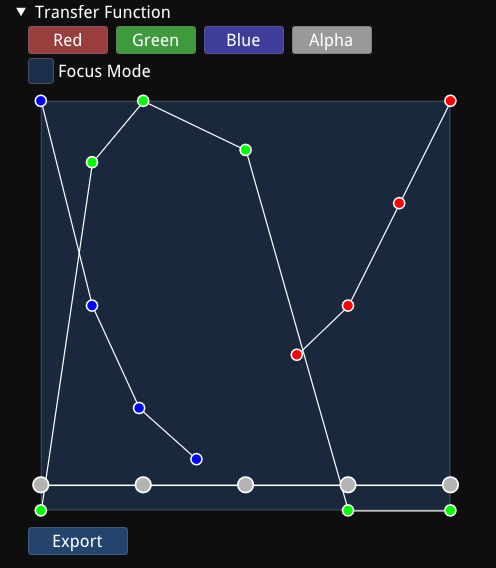

# ImGui Transfer Function Widget

An ImGui transfer function widget for volume rendering.



## Usage

Example snippet:

```cpp
TransferFunctionWidget trFnWidget;
trFnWidget.setDomain(256);
// ...

ImGui::Begin("Settings")
if (ImGui::TreeNodeEx("Transfer Function", ImGuiTreeNodeFlags_DefaultOpen)) {
    if (trFnWidget.show()) {
        const std::vector<float>& trFn = tfFnWidget.transferFunction();
        // Do something about trFn. Ex:
        // glTextureSubImage1D(texture, 0, 0, 256, GL_RGBA, GL_FLOAT, trFn.data());
    }
    ImGui::TreePop();
}
ImGui::End();
```
